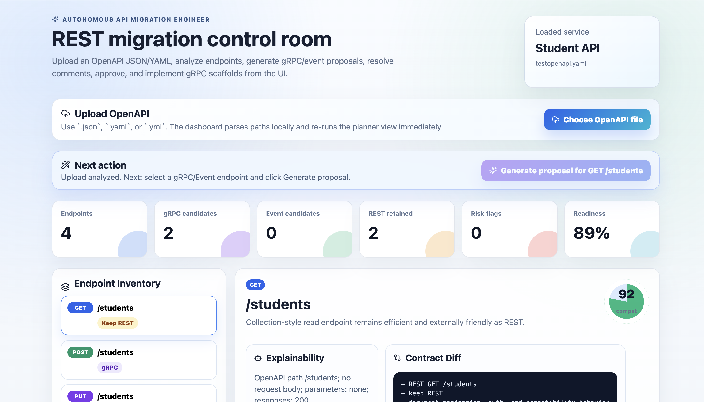
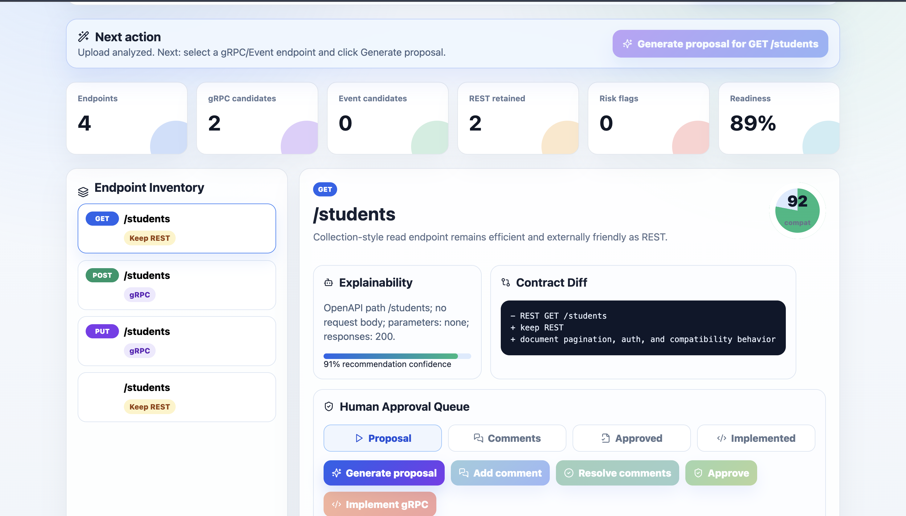
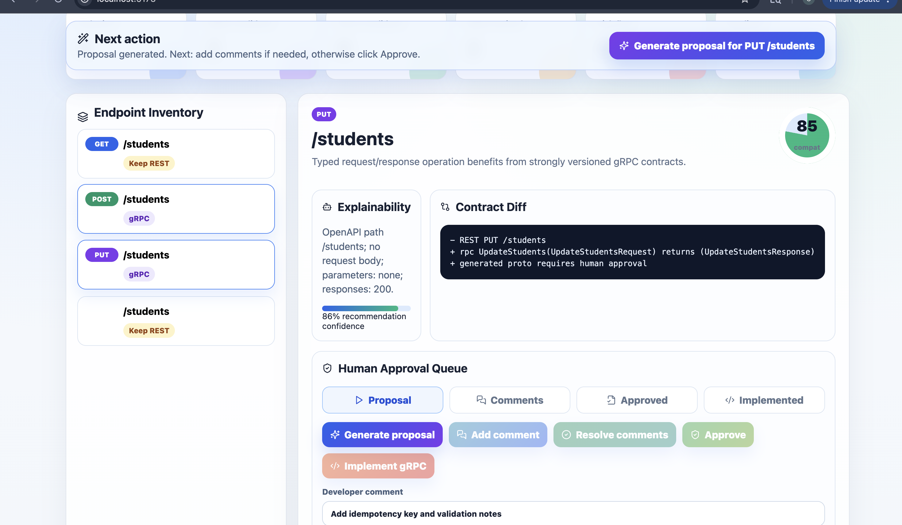
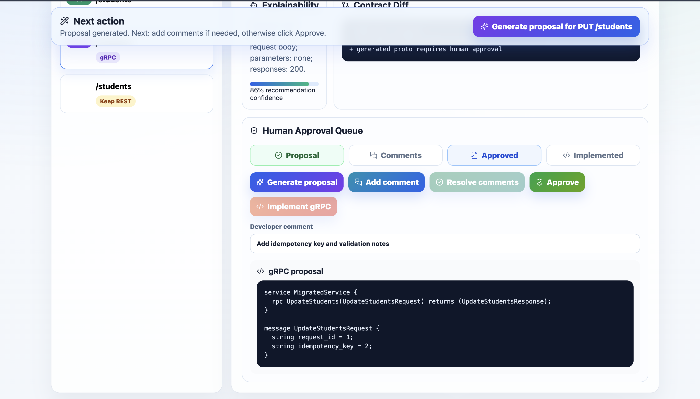
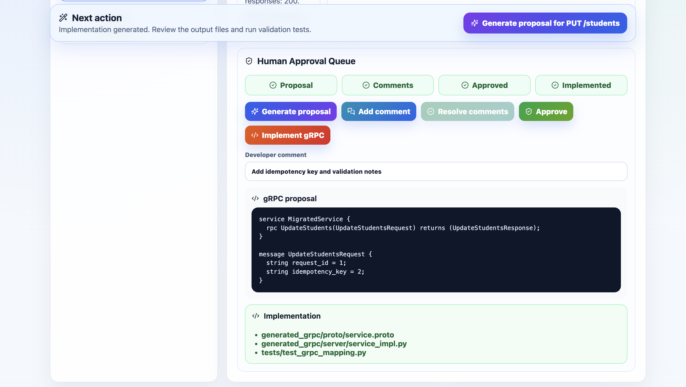

# Autonomous API Migration Engineer

AI-assisted platform for analyzing legacy REST services and proposing migrations to gRPC, event-driven architecture, and improved contracts.

This bootstrap is intentionally deterministic: it uses graph-style local agents, sample OpenAPI input, generated protobuf/event schemas, compatibility checks, reports, and tests without requiring paid external APIs.

## What Is Included

- FastAPI orchestration API in `apps/api_orchestrator`
- Interactive React dashboard in `apps/web-dashboard`
- Multi-agent workflow across scanner, planner, contract generator, verifier, and reporter agents
- OpenAPI v3 parser and sample legacy user-management service
- Generated artifacts with provenance metadata
- Human approval queue model before finalizing generated contracts
- Docker Compose for API, web, PostgreSQL, and Redis
- Unit/integration tests for the happy path
- GitHub Actions CI for Python tests and dashboard builds
- Contribution and changelog docs for collaborators

## Quick Start

Install the CLI package after the first PyPI release:

```bash
pip install autonomous-api-migration-engineer
```

Run an OpenAPI analysis from any project:

```bash
migration-engineer analyze \
  --openapi ./openapi.yaml \
  --output-dir ./migration-artifacts
```

Use it from Python:

```python
from autonomous_api_migration_engineer import run_migration

result = run_migration("openapi.yaml", "migration-artifacts")
print(result["plan"].readiness_score)
```

Run the FastAPI server after installing:

```bash
uvicorn autonomous_api_migration_engineer.api:app --reload --port 8000
```

Until the first PyPI release is published, install directly from GitHub:

```bash
pip install "git+https://github.com/ShivangiRay/autonomous-api-migration-engineer.git"
```

Package publishing notes are in [`docs/package-publishing.md`](docs/package-publishing.md).

Local development setup:

```bash
python -m venv .venv
source .venv/bin/activate
pip install -e ".[dev]"
pytest
uvicorn autonomous_api_migration_engineer.api:app --reload --port 8000
```

Dashboard scaffold:

```bash
cd apps/web-dashboard
npm install
npm run dev
```

Open the dashboard at:

```text
http://localhost:5173
```


The dashboard is an interactive local demo of the CLI workflow. You can:

- Upload an OpenAPI `.json`, `.yaml`, or `.yml` file.
- Analyze uploaded endpoints directly in the browser.
- Select REST endpoints from the inventory.
- Inspect recommendation rationale, evidence, compatibility score, and contract diff.
- Generate gRPC or event proposals.
- Add review comments.
- Resolve comments.
- Approve proposals.
- See the implementation panel after approval and simulate gRPC implementation output.
- Review Kafka vs RabbitMQ event transport reasoning.
- Watch an agent activity feed update as you interact.

After uploading a file, use the **Next action** bar:

1. Select a gRPC or Event endpoint from **Endpoint Inventory**.
2. Click **Generate proposal**.
3. Add comments if needed.
4. Resolve comments.
5. Approve the proposal.
6. For gRPC endpoints, click **Implement gRPC** to show generated proto/service/test outputs.

## Dashboard Walkthrough

The UI follows the same approval-first migration flow as the CLI, but makes every step visible.

### 1. Upload And Analyze OpenAPI



Upload an OpenAPI `.json`, `.yaml`, or `.yml` file. The dashboard parses the service name, endpoint paths, HTTP methods, request/response shapes, and response codes locally, then refreshes the endpoint inventory and readiness metrics.

In this example, the uploaded `testopenapi.yaml` file is recognized as **Student API**. The UI immediately shows:

- total endpoints discovered,
- gRPC candidates,
- event candidates,
- REST-retained endpoints,
- risk flags,
- migration readiness score,
- the next recommended action.

### 2. Review Endpoint Inventory



Select any endpoint from **Endpoint Inventory** to inspect why the system classified it as `Keep REST`, `gRPC`, or `Event`.

The selected endpoint panel shows:

- the migration recommendation,
- evidence from the OpenAPI path,
- compatibility score,
- explainability notes,
- REST-to-target contract diff,
- human approval queue controls.

This is where a developer checks whether the recommendation makes sense before allowing any generated output to move forward.

### 3. Generate A Proposal



For a gRPC or event candidate, click **Generate proposal**. The dashboard creates a reviewable proposal and changes the next action message to guide the developer.

The proposal is not treated as final code yet. It is a draft artifact that can receive comments, be revised, and then be approved.

### 4. Add Comments And Approve



Use **Add comment** when the proposed contract needs edits. In this example, the developer asks for an idempotency key and validation notes.

After comments are resolved, click **Approve**. The approval queue records that the proposal has passed review and displays the generated gRPC contract preview.

### 5. Implement gRPC Scaffold



After approval, click **Implement gRPC**. The dashboard shows the generated implementation outputs:

- `generated_grpc/proto/service.proto`,
- `generated_grpc/server/service_impl.py`,
- `tests/test_grpc_mapping.py`.

This models the intended product behavior: no generated contract is silently finalized, and implementation only happens after human approval.

Docker:

```bash
docker compose -f infra/docker-compose.yml up --build
```

## Demo Workflow

Run the sample workflow:

```bash
python -m libs.common.demo examples/sample-openapi/user-management.openapi.json build/artifacts
```

Interactive migration proposal flow:

```bash
migration-engineer analyze --interactive
```

The command prints each recommendation and asks before creating a proposal:

```text
System: POST /users is a migrate_grpc candidate.
System: Do you want to proceed and generate a proposal? [y/N]
```

If you answer `y`, proposal files are written under `build/proposals/`.

For the included sample service, accepting all actionable recommendations creates:

```text
build/proposals/proposal-post-users.json
build/proposals/proposal-get-users-userid.json
build/proposals/proposal-patch-users-userid-event.json
```

## Reviewing And Approving Proposals

Inspect a proposal:

```bash
python3 -m json.tool build/proposals/proposal-post-users.json
python3 -m json.tool build/proposals/proposal-get-users-userid.json
python3 -m json.tool build/proposals/proposal-patch-users-userid-event.json
```

Add review comments when the generated contract needs changes:

```bash
migration-engineer comment \
  --proposal build/proposals/proposal-post-users.json \
  --body "Add idempotency key and validation notes"
```

Resolve comments into the proposed contract:

```bash
migration-engineer resolve-comments \
  --proposal build/proposals/proposal-post-users.json
```

Approve a gRPC proposal:

```bash
migration-engineer approve \
  --proposal build/proposals/proposal-post-users.json
```

Generate the gRPC implementation scaffold after approval:

```bash
migration-engineer implement-grpc \
  --proposal build/proposals/proposal-post-users.json \
  --output-dir build/implementation-post-users
```

Check generated implementation files:

```bash
find build/implementation-post-users -type f
```

Expected files:

```text
build/implementation-post-users/generated_grpc/__init__.py
build/implementation-post-users/generated_grpc/server/__init__.py
build/implementation-post-users/generated_grpc/proto/user_service.proto
build/implementation-post-users/generated_grpc/server/user_service_impl.py
build/implementation-post-users/tests/test_create_user_grpc_mapping.py
```

Approve and implement another gRPC endpoint the same way:

```bash
migration-engineer approve \
  --proposal build/proposals/proposal-get-users-userid.json

migration-engineer implement-grpc \
  --proposal build/proposals/proposal-get-users-userid.json \
  --output-dir build/implementation-get-user
```

## Event Proposal Review

Event proposals are reviewable artifacts. Inspect the generated event recommendation:

```bash
python3 -m json.tool build/proposals/proposal-patch-users-userid-event.json
```

Look for:

```json
"transport": "kafka"
```

The event proposal recommends Kafka when the endpoint looks like a durable domain event that benefits from replay, ordering, auditability, and fan-out. It recommends RabbitMQ when the endpoint looks more like task routing, command dispatch, or worker handoff.

Current bootstrap support:

- gRPC proposals support comment, resolve, approve, and implementation scaffold generation.
- Event proposals support AsyncAPI generation and Kafka/RabbitMQ recommendation review.
- Event approval and event implementation scaffolding are planned next steps.

Artifact approval states:

- `pending_human_approval`: generated by the batch workflow and not accepted by a developer yet.
- `needs_review`: generated as an explicit proposal and waiting for review.
- `changes_requested`: developer comments were added and must be resolved.
- `approved`: developer accepted the proposal; implementation can proceed.
- `implemented`: generated implementation files and tests were created.

Use `analyze --interactive` when you want the tool to ask before creating proposals. Use `propose-grpc` or `propose-event` when you already know the endpoint you want to convert.

RAG-style local memory:

```bash
migration-engineer memory
migration-engineer propose-grpc --endpoint "POST /users"
```

The implementation step writes successful approved migrations into `build/memory/migration-memory.jsonl`. Future proposals retrieve similar local cases and include the retrieved cases plus learned adjustments in the proposal basis. This is not model fine-tuning; it is transparent retrieval over prior generated/reviewed artifacts.

Event transport proposal:

```bash
migration-engineer propose-event --endpoint "PATCH /users/{userId}"
```

The event proposal recommends Kafka when the endpoint looks like a durable domain event that benefits from replay, ordering, and fan-out. It recommends RabbitMQ when the endpoint looks more like command dispatch, task routing, or worker handoff.

Generated outputs include:

- `endpoint-inventory.json`
- `migration-plan.json`
- `contracts/user_service.proto`
- `events/user-events.asyncapi.json`
- `compatibility-report.json`
- `executive-report.md`
- `adr/0001-contract-migration-strategy.md`

Proposal outputs include the basis for the suggestion. The bootstrap does not train agents on private data; it uses deterministic rules over supplied OpenAPI/source evidence and records that basis in the proposal JSON.

---

## MCP Server (Model Context Protocol)

This project ships a fully-featured **MCP server** so any LLM host — Claude Desktop, Cursor, Gemini CLI, or any HTTP client — can call the migration tools directly.

### Install

```bash
pip install autonomous-api-migration-engineer
# or from source
pip install -e ".[dev]"
```

The MCP dependency (`mcp>=1.0`) is included automatically.

### Tools the LLM can call

| Tool | What it does |
|---|---|
| `analyze_rest_endpoint` | Parses an OpenAPI spec and returns a full gRPC mapping analysis: HTTP verb → rpc pattern, payload shapes → message fields, per-endpoint recommendations, confidence scores, and phased rollout plan |
| `generate_proto` | Generates proto3 file syntax — either for the full service or a single endpoint. Includes a header boilerplate with package/option placeholders |
| `migrate_code` | Runs the full agentic pipeline: scan → plan → propose → **auto-approve** → implement. Returns all generated file paths and their contents |
| `generate_grpc_client` | Generates a typed Python gRPC client class to replace old HTTP client calls, plus a `grpc_tools.protoc` compile command |

### Resources the LLM can read

| URI | Content |
|---|---|
| `migration://templates/proto_header` | Standard `.proto` file header boilerplate (package, go/java options, well-known imports) |
| `migration://templates/error_mapping` | gRPC ↔ HTTP status code mapping table + Python dict helpers |
| `migration://templates/interceptors` | Logging, auth Bearer, and exponential-backoff retry interceptors |
| `migration://templates/grpc_client` | Python gRPC client stub template with TLS and context manager |

### stdio mode — Claude Desktop

Add to `~/Library/Application Support/Claude/claude_desktop_config.json`:

```json
{
  "mcpServers": {
    "api-migration-engineer": {
      "command": "migration-engineer-mcp",
      "args": [],
      "env": {}
    }
  }
}
```

Restart Claude Desktop. The 4 tools appear in Claude's tool picker automatically.

### stdio mode — Cursor

Add to `.cursor/mcp.json` in your project root:

```json
{
  "mcpServers": {
    "api-migration-engineer": {
      "command": "migration-engineer-mcp",
      "args": []
    }
  }
}
```

Restart Cursor. The tools are available in Cursor's Agent mode.

### stdio mode — Gemini CLI

Add to `~/.gemini/settings.json`:

```json
{
  "mcpServers": {
    "api-migration-engineer": {
      "command": "migration-engineer-mcp",
      "args": []
    }
  }
}
```

### HTTP + SSE mode

Run the server on a local port (useful for web-based integrations):

```bash
migration-engineer-mcp --http --port 8000
```

Endpoints:

| Endpoint | Purpose |
|---|---|
| `POST /mcp` | JSON-RPC 2.0 — call any tool or read any resource |
| `GET /sse` | SSE event stream for streaming-capable hosts |
| `GET /health` | Health check |

Example tool call via HTTP:

```bash
curl -X POST http://localhost:8000/mcp \
  -H "Content-Type: application/json" \
  -d '{
    "jsonrpc": "2.0",
    "id": 1,
    "method": "tools/call",
    "params": {
      "name": "analyze_rest_endpoint",
      "arguments": {
        "openapi_path": "./testopenapi.yaml"
      }
    }
  }'
```

Example resource read via HTTP:

```bash
curl -X POST http://localhost:8000/mcp \
  -H "Content-Type: application/json" \
  -d '{
    "jsonrpc": "2.0",
    "id": 2,
    "method": "resources/read",
    "params": { "uri": "migration://templates/proto_header" }
  }'
```

### stdio fallback (no SDK required)

If the `mcp` package is not installed, the server falls back to a built-in JSON-RPC 2.0 stdio handler that supports all the same methods (`initialize`, `tools/list`, `tools/call`, `resources/list`, `resources/read`). Install the SDK for the best experience with Claude Desktop and Cursor.

### MCP tests

```bash
pytest tests/mcp/ -v
```
