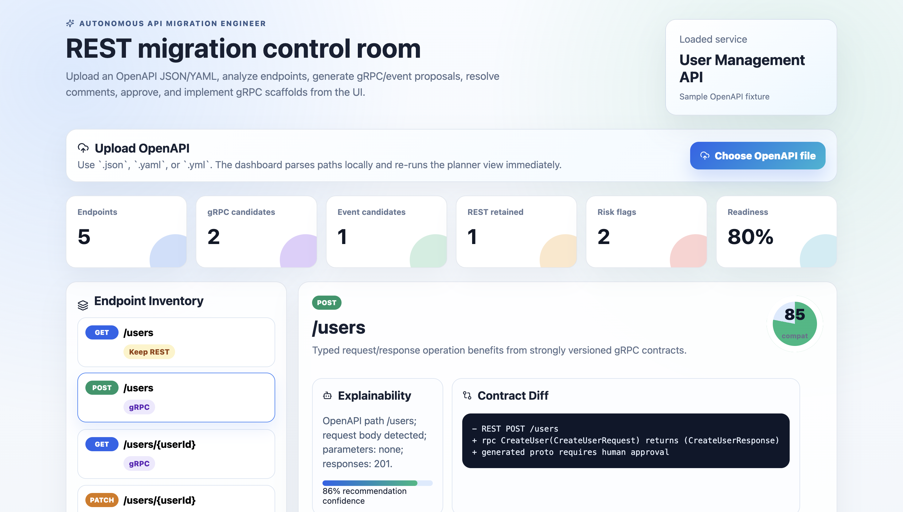

# Autonomous API Migration Engineer

AI-assisted platform for analyzing legacy REST services and proposing migrations to gRPC, event-driven architecture, and improved contracts.

This bootstrap is intentionally deterministic: it uses graph-style local agents, sample OpenAPI input, generated protobuf/event schemas, compatibility checks, reports, and tests without requiring paid external APIs.

## What Is Included

- FastAPI orchestration API in `apps/api-orchestrator`
- Interactive React dashboard in `apps/web-dashboard`
- Multi-agent workflow across scanner, planner, contract generator, verifier, and reporter agents
- OpenAPI v3 parser and sample legacy user-management service
- Generated artifacts with provenance metadata
- Human approval queue model before finalizing generated contracts
- Docker Compose for API, web, PostgreSQL, and Redis
- Unit/integration tests for the happy path

## Quick Start

```bash
python -m venv .venv
source .venv/bin/activate
pip install -e ".[dev]"
pytest
uvicorn apps.api-orchestrator.main:app --reload --port 8000
```

Dashboard scaffold:

```bash
cd apps/web-dashboard
npm install
npm run dev
```

Open the dashboard at:

```text
http://localhost:5173
```



The dashboard is an interactive local demo of the CLI workflow. You can:

- Upload an OpenAPI `.json`, `.yaml`, or `.yml` file.
- Analyze uploaded endpoints directly in the browser.
- Select REST endpoints from the inventory.
- Inspect recommendation rationale, evidence, compatibility score, and contract diff.
- Generate gRPC or event proposals.
- Add review comments.
- Resolve comments.
- Approve proposals.
- See the implementation panel after approval and simulate gRPC implementation output.
- Review Kafka vs RabbitMQ event transport reasoning.
- Watch an agent activity feed update as you interact.

After uploading a file, use the **Next action** bar:

1. Select a gRPC or Event endpoint from **Endpoint Inventory**.
2. Click **Generate proposal**.
3. Add comments if needed.
4. Resolve comments.
5. Approve the proposal.
6. For gRPC endpoints, click **Implement gRPC** to show generated proto/service/test outputs.

Docker:

```bash
docker compose -f infra/docker-compose.yml up --build
```

## Demo Workflow

Run the sample workflow:

```bash
python -m libs.common.demo examples/sample-openapi/user-management.openapi.json build/artifacts
```

Interactive migration proposal flow:

```bash
migration-engineer analyze --interactive
```

The command prints each recommendation and asks before creating a proposal:

```text
System: POST /users is a migrate_grpc candidate.
System: Do you want to proceed and generate a proposal? [y/N]
```

If you answer `y`, proposal files are written under `build/proposals/`.

For the included sample service, accepting all actionable recommendations creates:

```text
build/proposals/proposal-post-users.json
build/proposals/proposal-get-users-userid.json
build/proposals/proposal-patch-users-userid-event.json
```

## Reviewing And Approving Proposals

Inspect a proposal:

```bash
python3 -m json.tool build/proposals/proposal-post-users.json
python3 -m json.tool build/proposals/proposal-get-users-userid.json
python3 -m json.tool build/proposals/proposal-patch-users-userid-event.json
```

Add review comments when the generated contract needs changes:

```bash
migration-engineer comment \
  --proposal build/proposals/proposal-post-users.json \
  --body "Add idempotency key and validation notes"
```

Resolve comments into the proposed contract:

```bash
migration-engineer resolve-comments \
  --proposal build/proposals/proposal-post-users.json
```

Approve a gRPC proposal:

```bash
migration-engineer approve \
  --proposal build/proposals/proposal-post-users.json
```

Generate the gRPC implementation scaffold after approval:

```bash
migration-engineer implement-grpc \
  --proposal build/proposals/proposal-post-users.json \
  --output-dir build/implementation-post-users
```

Check generated implementation files:

```bash
find build/implementation-post-users -type f
```

Expected files:

```text
build/implementation-post-users/generated_grpc/__init__.py
build/implementation-post-users/generated_grpc/server/__init__.py
build/implementation-post-users/generated_grpc/proto/user_service.proto
build/implementation-post-users/generated_grpc/server/user_service_impl.py
build/implementation-post-users/tests/test_create_user_grpc_mapping.py
```

Approve and implement another gRPC endpoint the same way:

```bash
migration-engineer approve \
  --proposal build/proposals/proposal-get-users-userid.json

migration-engineer implement-grpc \
  --proposal build/proposals/proposal-get-users-userid.json \
  --output-dir build/implementation-get-user
```

## Event Proposal Review

Event proposals are reviewable artifacts. Inspect the generated event recommendation:

```bash
python3 -m json.tool build/proposals/proposal-patch-users-userid-event.json
```

Look for:

```json
"transport": "kafka"
```

The event proposal recommends Kafka when the endpoint looks like a durable domain event that benefits from replay, ordering, auditability, and fan-out. It recommends RabbitMQ when the endpoint looks more like task routing, command dispatch, or worker handoff.

Current bootstrap support:

- gRPC proposals support comment, resolve, approve, and implementation scaffold generation.
- Event proposals support AsyncAPI generation and Kafka/RabbitMQ recommendation review.
- Event approval and event implementation scaffolding are planned next steps.

Artifact approval states:

- `pending_human_approval`: generated by the batch workflow and not accepted by a developer yet.
- `needs_review`: generated as an explicit proposal and waiting for review.
- `changes_requested`: developer comments were added and must be resolved.
- `approved`: developer accepted the proposal; implementation can proceed.
- `implemented`: generated implementation files and tests were created.

Use `analyze --interactive` when you want the tool to ask before creating proposals. Use `propose-grpc` or `propose-event` when you already know the endpoint you want to convert.

RAG-style local memory:

```bash
migration-engineer memory
migration-engineer propose-grpc --endpoint "POST /users"
```

The implementation step writes successful approved migrations into `build/memory/migration-memory.jsonl`. Future proposals retrieve similar local cases and include the retrieved cases plus learned adjustments in the proposal basis. This is not model fine-tuning; it is transparent retrieval over prior generated/reviewed artifacts.

Event transport proposal:

```bash
migration-engineer propose-event --endpoint "PATCH /users/{userId}"
```

The event proposal recommends Kafka when the endpoint looks like a durable domain event that benefits from replay, ordering, and fan-out. It recommends RabbitMQ when the endpoint looks more like command dispatch, task routing, or worker handoff.

Generated outputs include:

- `endpoint-inventory.json`
- `migration-plan.json`
- `contracts/user_service.proto`
- `events/user-events.asyncapi.json`
- `compatibility-report.json`
- `executive-report.md`
- `adr/0001-contract-migration-strategy.md`

Proposal outputs include the basis for the suggestion. The bootstrap does not train agents on private data; it uses deterministic rules over supplied OpenAPI/source evidence and records that basis in the proposal JSON.
